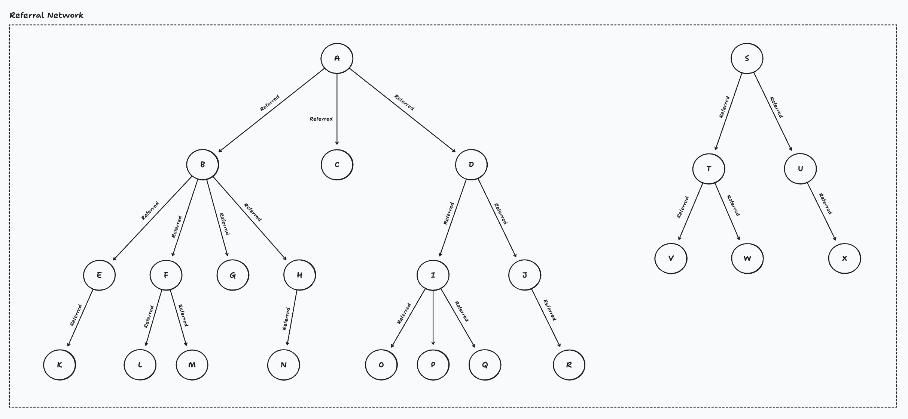

# Referral Network

A TypeScript Node.js project with Jest for testing, ESLint (flat config) for linting, and Prettier for formatting.

## Language & Setup

- **Language**: TypeScript (5.9)
- **Runtime**: Node.js (>= 18 recommended)
- **Module system**: ESM
- **Package manager**: pnpm (10.14.0)
- **Linter**: ESLint (9)
- **Formatter**: Prettier (3)
- **Test runner**: Jest 29 (via `ts-jest`)

### Commands

```sh
# 0) Install pnpm (recommended via Corepack)
corepack enable && corepack prepare pnpm@10.14.0 --activate
# Fallback (if Corepack is unavailable): npm install -g pnpm@10.14.0

# 1) Install dependencies
pnpm install

# 2) Type-check the project
pnpm run typecheck

# 3) Compile TypeScript (emit to dist/)
pnpm exec tsc -p tsconfig.json

# Optional: lint and format
pnpm run lint
pnpm run format
```

## Running Tests

```sh
pnpm run test
```

## Requirements, Constraints, and Assumptions

**User**
1. Has an unique identity.
3. Can refer other users.
4. Cannot refer self.
5. Can be referred by one user only.

**Referral Network**
1. Can add new users.
2. Can query for existing users' details.
3. Can get direct referrals of a given user.
4. Can add directed, referral links from referrer to another user.
4. Can delete users.
   - Assumption: Referrals will not have a referrer once the original referrer is deleted.
5. Should be acyclic.
   - Reject any operation which creates a cycle.
   
## Design Choices

### Core Data Structure: Forest

The core of our referral network is modeled as a forest—a collection of disjoint trees. This choice was
made after analyzing the requirements and constraints, as it provides a model that is both efficient and
conceptually simple.



### Rationale

Choosing forest as the data structure was based upon these three constraints derived from the requirements:

1. **Unique Referrer:** An user can be referred by at most one other user. Considering user as a node in the
   graph, this means each node has a maximum of one incoming edge.
2. **Acyclic Relationships:** The network must prevent referral loops (e.g., A refers B, B refers C, and C
   refers A). The graph must be acyclic.
3. **Directed Relationships:** Referrals are unidirectional, flowing from a referrer to a candidate. This
   implies a directed graph.

Forest satisfies all these constraints and is easier to visualize/reason about. Each separate tree in the
forest represents a distinct referral chain, with its root being a user who was not referred by anyone within
the system.

Another benefit that forest gives us is the efficiency and speed in running algorithms like cycle detection.
With forest, cycle detection is reduced to finding path to root, which is significantly more efficient than
achieving the same with BFS, DFS, etc.

### API Design

The `ReferralNetwork` models a directed acyclic forest. Create an instance and use the methods below to manage users and links.

```ts
import { ReferralNetwork } from './src/ReferralNetwork';

const network = new ReferralNetwork();
```

#### Methods

- **`registerUser(id?: ID, referrerId?: ID): void`**
  - Registers a new user. If `id` is omitted, a random UUID is generated internally.
  - Throws error if:
    - `referrerId` is provided but does not exist.
    - An user with the same ID as input ID already exists.
  - Time Complexity: O(1) (with or without `referrerId` in current implementation)
  - Space Complexity: O(1) auxiliary

- **`getUserDetails(id: ID): UserDetails`**
  - Returns a snapshot of the user's details.
  - Throws error if an user with input ID does not exist.
  - Time: O(1)
  - Space: O(1) auxiliary

- **`getDirectReferrals(id: ID): ID[]`**
  - Returns the list of direct referral IDs for the given user.
  - Throws error if an user with input ID does not exist.
  - Time: O(out-degree) (creates an array from the referrals ID set)
  - Space: O(out-degree) for the returned array

- **`linkUserToReferrer(referrerId: ID, userId: ID): void`**
  - Links an existing `userId` to `referrerId` and prevents cycles via an ancestor check.
  - Throws error if:
    - Referrer with ID `referrerId` does not exist
    - User with ID `userId` does not exist.
    - When the link would introduce a cycle.
  - Time: O(depth) (walks up the referrer chain to prevent cycles)
  - Space: O(1) auxiliary

- **`deleteUser(id: ID): void`**
  - Deletes a user. Their direct referrals (if any) remain in the network with `referrerId` set to `null`.
  - Throws error if an user with input ID does not exist.
  - Time: O(out-degree) (iterates direct referrals to nullify their `referrerId`)
  - Space: O(1) auxiliary

#### Example

```ts
const network = new ReferralNetwork();

// Add a root referrer
network.registerUser('A');

// Add referred users
network.registerUser('B', 'A');                       // Registers B with A as its referrer
network.registerUser('C', 'A');                       // Registers C with A as its referrer

// Link an existing user to a referrer
network.registerUser('D');
network.linkUserToReferrer('A', 'D');                 // Links D as the referrer of A

// Query
const a = network.getUserDetails('A');                // { id: 'A', referrerId: 'D' }
const aDirect = network.getDirectReferrals('A');      // ['B','C','D']

// Delete
network.deleteUser('C');                              // 'C' is removed; its referrals (if any) become roots
```

